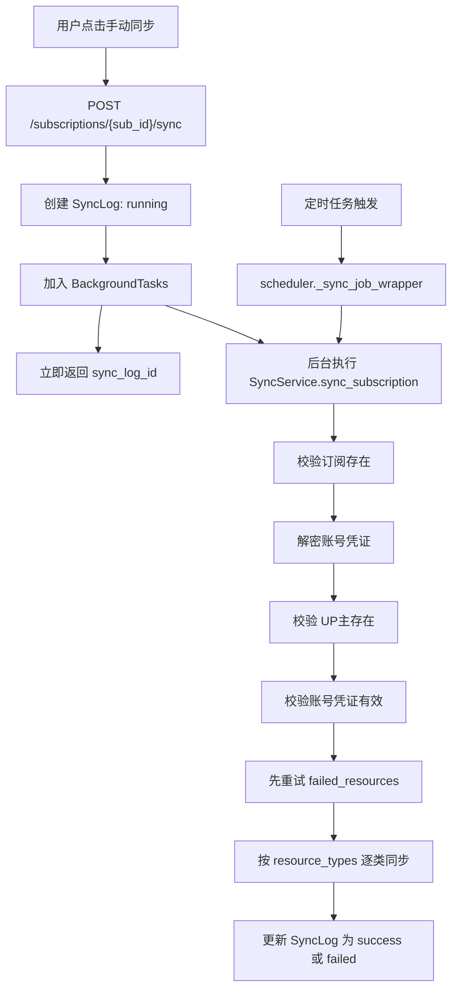
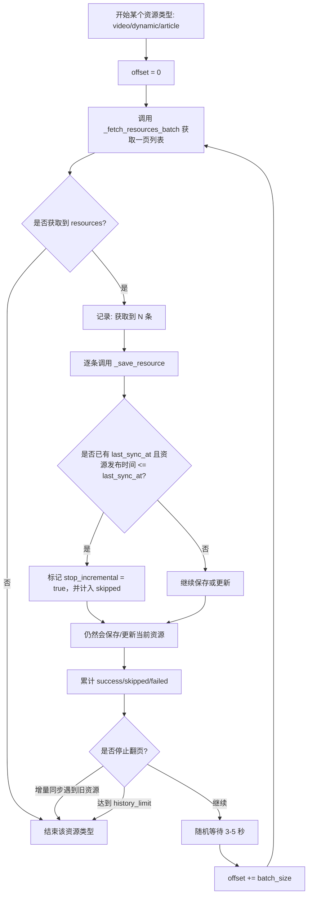
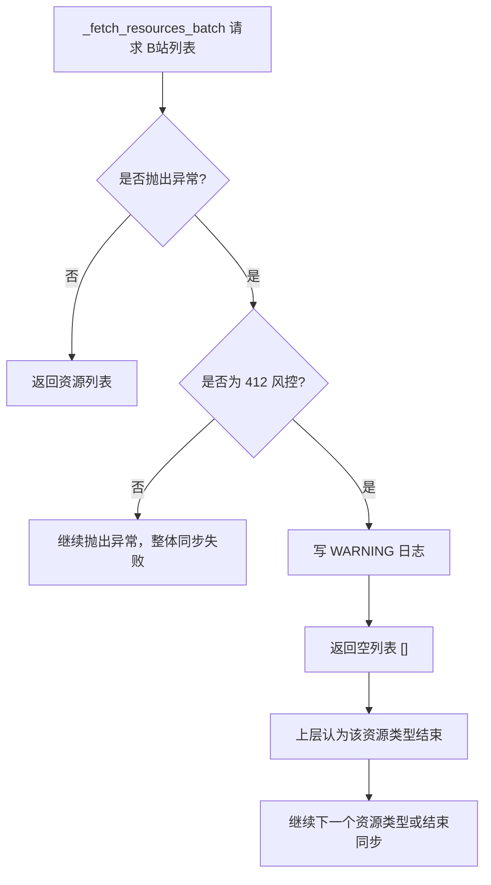
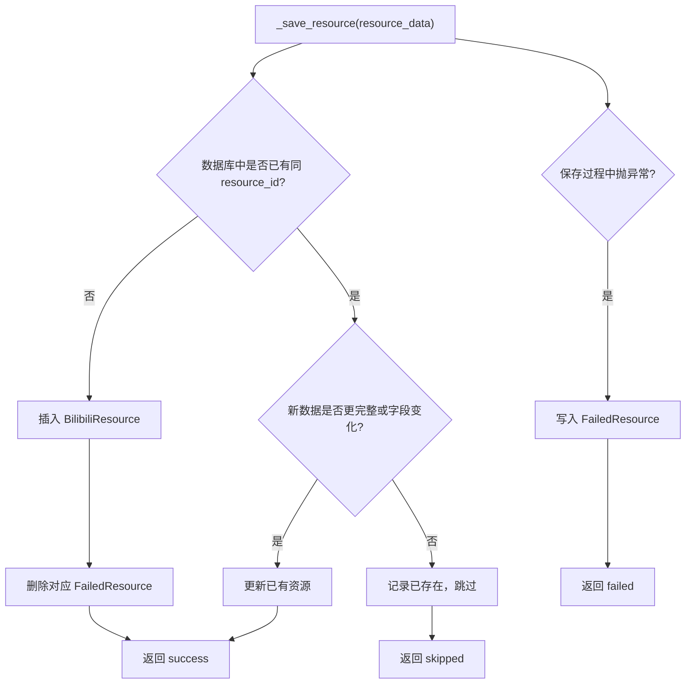
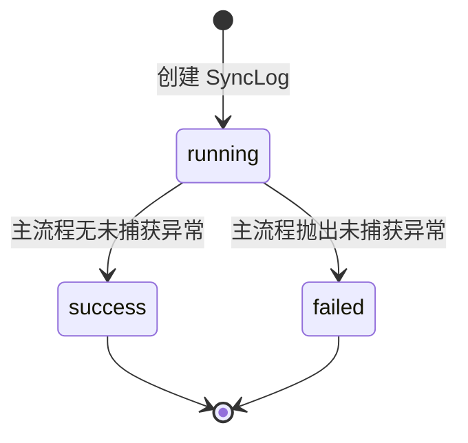
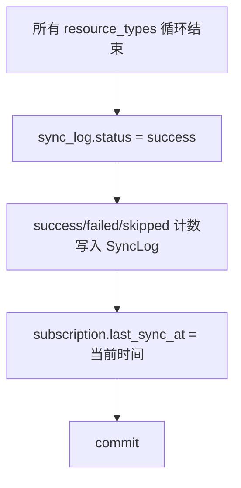
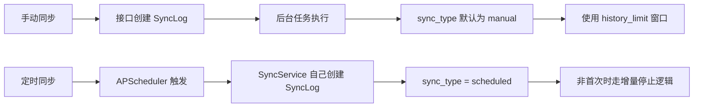
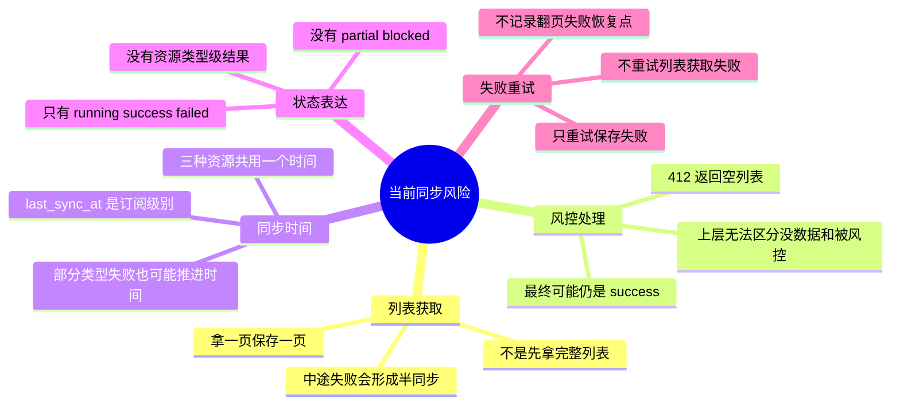
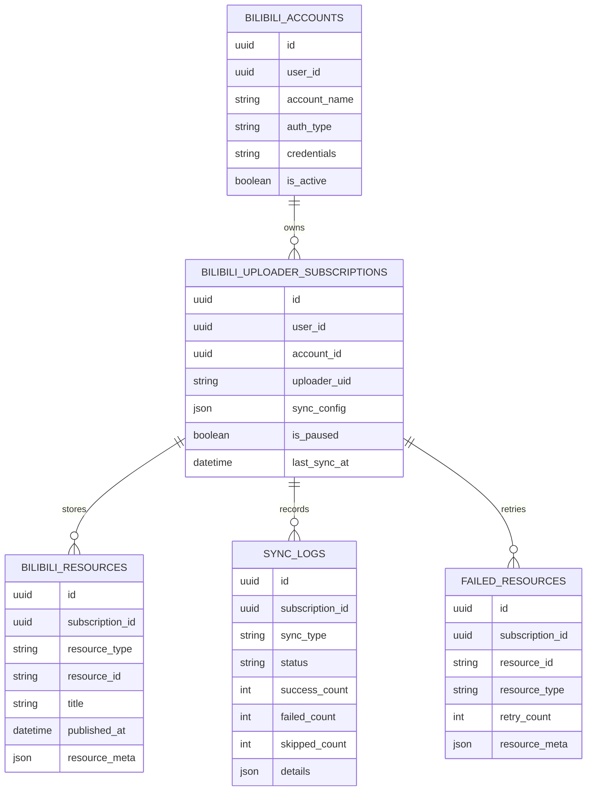

# Bilibili 当前同步接口与同步策略

本文档只描述当前代码的真实行为，不包含重新设计方案。

相关代码：

- `backend/app/bilibili/router.py`
- `backend/app/bilibili/sync_service.py`
- `backend/app/bilibili/scheduler.py`
- `backend/app/bilibili/models.py`
- `backend/app/bilibili/schemas.py`

## 一、同步相关接口

### 1. 手动触发同步

```http
POST /api/v1/bilibili/subscriptions/{sub_id}/sync
```

用途：手动启动某个订阅的同步任务。

权限：`bilibili:subscription:sync`

路径参数：

| 参数 | 类型 | 说明 |
| --- | --- | --- |
| `sub_id` | UUID | 订阅 ID |

响应：

```json
{
  "sync_log_id": "uuid",
  "message": "同步已开始"
}
```

当前行为：

- 接口先创建一条 `SyncLog`，状态为 `running`。
- 然后把实际同步逻辑放入 FastAPI `BackgroundTasks` 后台执行。
- HTTP 请求不会等待同步完成。
- 同步成功或失败后，后台任务更新这条 `SyncLog`。

### 2. 重试失败资源

```http
POST /api/v1/bilibili/subscriptions/{sub_id}/retry-failed
```

用途：重试保存失败的资源。

权限：`bilibili:subscription:sync`

响应：

```json
{
  "total": 3,
  "success": 2,
  "failed": 1
}
```

当前行为：

- 只读取 `failed_resources` 表中 `retry_count < 5` 的记录。
- 使用记录里的 `resource_meta` 再执行一次保存。
- 不重新请求 B站列表。
- 不处理“列表获取失败”或“风控导致列表没拿完整”的情况。

### 3. 查询同步日志列表

```http
GET /api/v1/bilibili/sync-logs?subscription_id={subscription_id}
```

用途：查询某个订阅最近的同步日志。

权限：`bilibili:sync-log:view`

查询参数：

| 参数 | 类型 | 必填 | 说明 |
| --- | --- | --- | --- |
| `subscription_id` | UUID | 是 | 订阅 ID |

当前行为：

- 默认最多返回最近 20 条日志。
- 按 `start_time DESC` 排序。
- 日志详情存放在 `details` JSON 字段中。

### 4. 查询单条同步日志

```http
GET /api/v1/bilibili/sync-logs/{log_id}
```

用途：查询单条同步日志详情。

权限：`bilibili:sync-log:view`

路径参数：

| 参数 | 类型 | 说明 |
| --- | --- | --- |
| `log_id` | UUID | 同步日志 ID |

返回字段核心含义：

| 字段 | 说明 |
| --- | --- |
| `status` | 当前只有 `running`、`success`、`failed` |
| `total_count` | `success_count + skipped_count + failed_count` |
| `success_count` | 保存成功或更新成功数量 |
| `skipped_count` | 已存在、增量窗口内旧资源等跳过数量 |
| `failed_count` | 单个资源保存失败数量 |
| `error_message` | 整体同步失败时的错误信息 |
| `details` | 同步过程中的实时日志数组 |

### 5. WebSocket 实时同步日志

```http
WS /api/v1/bilibili/ws/sync-logs/{subscription_id}?token={jwt}
```

用途：前端实时接收同步过程日志。

鉴权：通过 query 参数 `token` 传 JWT。

当前行为：

- 连接时校验用户身份和订阅权限。
- 连接成功后，先补发最近一条同步日志的 `details`。
- 后续同步过程调用 `_send_log()` 时，会同时写入数据库并广播到 WebSocket。
- 客户端需要保持连接，服务端通过 `receive_text()` 等待客户端消息。

## 二、同步配置

订阅创建和更新时使用 `sync_config`。

```json
{
  "resource_types": ["video", "dynamic", "article"],
  "sync_frequency": "6h",
  "history_limit": 50,
  "batch_size": 50
}
```

字段说明：

| 字段 | 说明 |
| --- | --- |
| `resource_types` | 要同步的资源类型，支持 `video`、`dynamic`、`article` |
| `sync_frequency` | 定时同步频率，支持 `1h`、`6h`、`1d`、`1w`、`manual` |
| `history_limit` | 首次同步或手动同步时最多获取多少条；`null` 表示不限制 |
| `batch_size` | 每次分页获取数量，默认 50 |

当前特殊行为：

- 首次同步：如果有 `history_limit`，按该数量限制历史资源。
- 手动同步：即使不是首次同步，也会使用 `history_limit`。
- 定时同步：非首次时按增量逻辑停止，不使用历史窗口。

## 三、整体同步流程



## 四、当前资源类型同步流程

当前实现是“拿一页、保存一页”，不是“先拿完整列表、再统一保存”。



## 五、当前风控处理

当前只识别 B站 412 风控。

识别逻辑：

- `NetworkException.status == 412`
- `ResponseCodeException.code == 412`
- 异常字符串包含 `状态码：412` 或 `错误号: 412`

当前处理方式：



当前日志示例：

```json
{
  "level": "WARNING",
  "message": "获取video列表触发 B站风控，已跳过该类型，本次同步继续。",
  "error": "网络错误，状态码：412 ..."
}
```

重要影响：

- 风控不会让整体同步失败。
- 风控会让当前资源类型提前结束。
- 上层无法区分“真的没数据”和“风控后返回空列表”。
- 如果其他资源类型正常，最终 `SyncLog.status` 仍可能是 `success`。

## 六、保存资源流程



说明：

- `_save_resource()` 有 tenacity 重试，最多 3 次。
- 保存失败会写入 `failed_resources`。
- 失败重试只针对单个资源保存失败，不针对列表获取失败。
- 已存在资源如果 `full_content` 更完整，会更新原记录。

## 七、同步状态变化



当前状态只有三种：

| 状态 | 含义 |
| --- | --- |
| `running` | 同步中 |
| `success` | 同步流程正常走完 |
| `failed` | 同步流程抛出未捕获异常 |

注意：

- 当前没有 `partial` 状态。
- 当前没有 `blocked` 状态。
- 当前没有“某个资源类型失败但整体部分成功”的结构化状态。
- 412 风控被 `_fetch_resources_batch()` 吃掉并返回空列表，所以通常不会进入 `failed`。

## 八、`last_sync_at` 当前语义

字段位置：`bilibili_uploader_subscriptions.last_sync_at`

当前行为：

- 整体同步流程结束且没有未捕获异常时，统一更新为当前时间。
- 这个字段是订阅级别的，不是资源类型级别的。
- video、dynamic、article 共用同一个 `last_sync_at`。



影响：

- 如果 video 触发风控被跳过，但 dynamic/article 正常完成，整体仍可能更新 `last_sync_at`。
- 下次增量同步会以新的 `last_sync_at` 作为停止依据。
- 因为 `last_sync_at` 不是按资源类型记录，所以无法表达“动态同步成功，但视频没有同步成功”。

## 九、手动同步和定时同步差异



差异总结：

| 项目 | 手动同步 | 定时同步 |
| --- | --- | --- |
| 触发方式 | HTTP 接口 | APScheduler |
| SyncLog 创建方 | router | SyncService |
| `sync_type` | `manual` | `scheduled` |
| 非首次是否使用 `history_limit` | 是 | 否 |
| 是否立即返回 | 是 | 不涉及 HTTP 返回 |

## 十、当前同步机制的主要风险点

这些是当前实现的行为风险，不是新方案。



更直白地说：

- 当前同步不是“先拿完整清单，再保存”。
- 当前风控会被当成“这个类型没更多数据了”。
- 当前成功状态只能表示“程序跑完了”，不能保证“所有资源类型都完整同步了”。
- 当前 `last_sync_at` 可能在资源类型不完整的情况下被更新。

## 十一、当前接口和数据表关系


